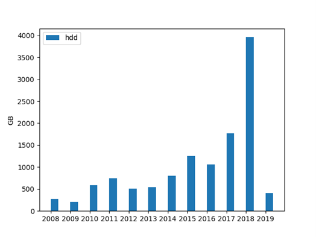
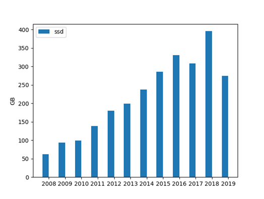
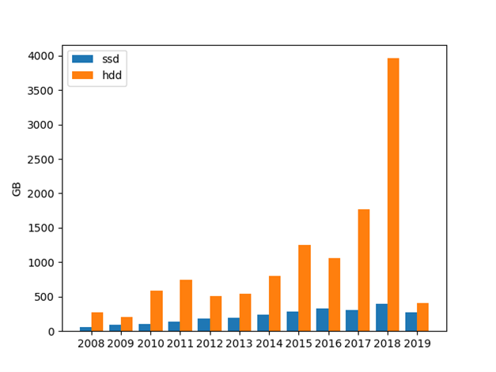

# Have the capacity of ssds and hdds gone up over the from 2008 to 2019?

In this project I got data from __kaggle__ about ssd and hdd capacity over a period of 11 years.
I then cleaned, analyzed and presented the data in a clean and easy to read format.

## Hdds

This is the result when the code was ran the code the hdd seem to be inconsistent but are taking an upwards trajectory until 2019.

## SSDs

The ssd capacity consistently goes up every year except in 2017 and 2019.

## Both SSDs and HDDs on the same graph

## Conclusion

In conclusion SSDs and HDDs have risen in capacity over the time period selected except in 2019 with may be because of covid 19.